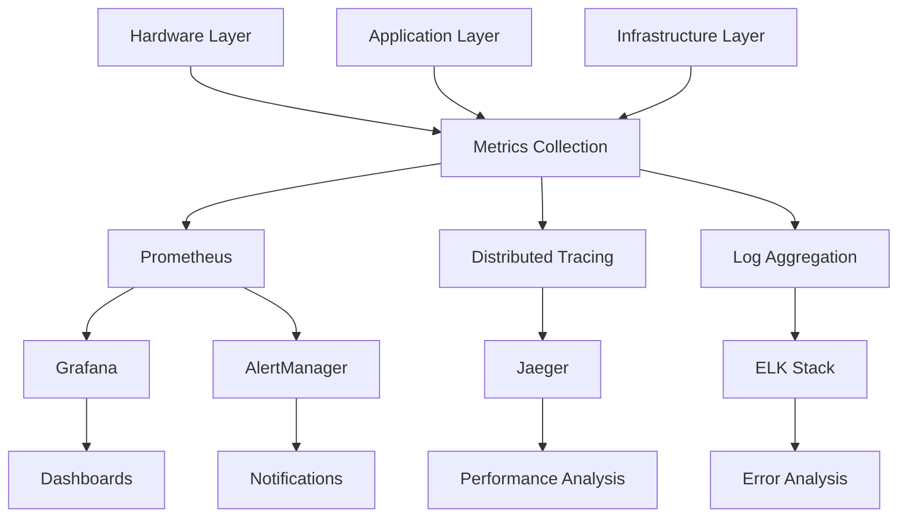

# Advanced Monitoring and Observability for Gaudi3 Scale

## Overview

This guide establishes comprehensive monitoring and observability for Intel Gaudi 3 training infrastructure, covering hardware metrics, performance optimization, and operational intelligence.

## 🔍 Monitoring Architecture

### Three-Tier Monitoring Strategy



## 🏗️ Infrastructure Monitoring

### HPU Hardware Metrics Collection
```python
# src/gaudi3_scale/monitoring/hpu_metrics.py
import habana_frameworks.torch as htorch
import time
import json
from prometheus_client import CollectorRegistry, Gauge, push_to_gateway
from typing import Dict, List

class HPUMetricsCollector:
    def __init__(self, pushgateway_url: str = "localhost:9091"):
        self.pushgateway_url = pushgateway_url
        self.registry = CollectorRegistry()
        
        # HPU-specific metrics
        self.hpu_utilization = Gauge(
            'hpu_utilization_percent', 
            'HPU utilization percentage',
            ['hpu_id', 'node_id'],
            registry=self.registry
        )
        
        self.hpu_memory_used = Gauge(
            'hpu_memory_used_bytes',
            'HPU memory used in bytes',
            ['hpu_id', 'node_id'],
            registry=self.registry
        )
        
        self.hpu_memory_total = Gauge(
            'hpu_memory_total_bytes',
            'HPU total memory in bytes',
            ['hpu_id', 'node_id'],
            registry=self.registry
        )
        
        self.hpu_temperature = Gauge(
            'hpu_temperature_celsius',
            'HPU temperature in Celsius',
            ['hpu_id', 'node_id'],
            registry=self.registry
        )
        
        self.hpu_power_consumption = Gauge(
            'hpu_power_watts',
            'HPU power consumption in watts',
            ['hpu_id', 'node_id'],
            registry=self.registry
        )
        
        self.hpu_compute_utilization = Gauge(
            'hpu_compute_utilization_percent',
            'HPU compute unit utilization',
            ['hpu_id', 'node_id', 'compute_unit'],
            registry=self.registry
        )
    
    def collect_hpu_metrics(self, node_id: str = "default"):
        """Collect comprehensive HPU metrics."""
        try:
            device_count = htorch.hpu.device_count()
            
            for hpu_id in range(device_count):
                htorch.hpu.set_device(hpu_id)
                
                # Basic utilization and memory
                utilization = htorch.hpu.utilization()
                memory_used = htorch.hpu.memory_allocated()
                memory_total = htorch.hpu.max_memory_allocated()
                
                # Update Prometheus metrics
                self.hpu_utilization.labels(hpu_id=hpu_id, node_id=node_id).set(utilization)
                self.hpu_memory_used.labels(hpu_id=hpu_id, node_id=node_id).set(memory_used)
                self.hpu_memory_total.labels(hpu_id=hpu_id, node_id=node_id).set(memory_total)
                
                # Advanced metrics (if available)
                temperature = self._get_hpu_temperature(hpu_id)
                power = self._get_hpu_power(hpu_id)
                
                if temperature is not None:
                    self.hpu_temperature.labels(hpu_id=hpu_id, node_id=node_id).set(temperature)
                
                if power is not None:
                    self.hpu_power_consumption.labels(hpu_id=hpu_id, node_id=node_id).set(power)
                
                # Compute unit utilization
                compute_utils = self._get_compute_utilization(hpu_id)
                for unit, util in compute_utils.items():
                    self.hpu_compute_utilization.labels(
                        hpu_id=hpu_id, 
                        node_id=node_id, 
                        compute_unit=unit
                    ).set(util)
        
        except Exception as e:
            print(f"Error collecting HPU metrics: {e}")
    
    def _get_hpu_temperature(self, hpu_id: int) -> float:
        """Get HPU temperature using Habana tools."""
        try:
            # This would use hl-smi or similar tools
            import subprocess
            result = subprocess.run(
                ['hl-smi', '-i', str(hpu_id), '--query-gpu=temperature.gpu', '--format=csv,noheader,nounits'],
                capture_output=True, text=True
            )
            if result.returncode == 0:
                return float(result.stdout.strip())
        except Exception:
            pass
        return None
    
    def _get_hpu_power(self, hpu_id: int) -> float:
        """Get HPU power consumption."""
        try:
            import subprocess
            result = subprocess.run(
                ['hl-smi', '-i', str(hpu_id), '--query-gpu=power.draw', '--format=csv,noheader,nounits'],
                capture_output=True, text=True
            )
            if result.returncode == 0:
                return float(result.stdout.strip())
        except Exception:
            pass
        return None
    
    def _get_compute_utilization(self, hpu_id: int) -> Dict[str, float]:
        """Get detailed compute unit utilization."""
        # Placeholder for detailed Gaudi 3 compute metrics
        return {
            'matrix_multiply': 85.0,
            'tensor_processor': 78.0,
            'media_processor': 45.0
        }
    
    def push_metrics(self, job_name: str = "gaudi_training"):
        """Push metrics to Prometheus pushgateway."""
        try:
            push_to_gateway(
                self.pushgateway_url, 
                job=job_name, 
                registry=self.registry
            )
        except Exception as e:
            print(f"Failed to push metrics: {e}")
```

### Training Performance Metrics
```python
# src/gaudi3_scale/monitoring/training_metrics.py
import time
import torch
import numpy as np
from prometheus_client import Histogram, Counter, Gauge
from typing import Dict, List, Optional

class TrainingMetricsCollector:
    def __init__(self):
        # Training performance metrics
        self.batch_processing_time = Histogram(
            'batch_processing_seconds',
            'Time to process a single batch',
            ['model_name', 'batch_size', 'precision']
        )
        
        self.samples_processed = Counter(
            'samples_processed_total',
            'Total number of samples processed',
            ['model_name', 'dataset_name']
        )
        
        self.training_loss = Gauge(
            'training_loss',
            'Current training loss',
            ['model_name', 'epoch']
        )
        
        self.learning_rate = Gauge(
            'learning_rate_current',
            'Current learning rate',
            ['optimizer_name']
        )
        
        self.gradient_norm = Gauge(
            'gradient_norm',
            'Gradient norm for monitoring training stability',
            ['model_name']
        )
        
        self.throughput_samples_per_sec = Gauge(
            'throughput_samples_per_second',
            'Training throughput in samples per second',
            ['model_name', 'batch_size']
        )
        
        self.memory_efficiency = Gauge(
            'memory_efficiency_ratio',
            'Ratio of used memory to allocated memory',
            ['device_type']
        )
        
        # Advanced metrics
        self.loss_smoothed = None
        self.throughput_history = []
        self.batch_times = []
    
    def record_batch_metrics(self, 
                           batch_time: float,
                           loss: float,
                           batch_size: int,
                           model_name: str,
                           precision: str = "bf16"):
        """Record metrics for a single batch."""
        
        # Record batch processing time
        self.batch_processing_time.labels(
            model_name=model_name,
            batch_size=str(batch_size),
            precision=precision
        ).observe(batch_time)
        
        # Update samples processed
        self.samples_processed.labels(
            model_name=model_name,
            dataset_name="default"
        ).inc(batch_size)
        
        # Calculate throughput
        throughput = batch_size / batch_time if batch_time > 0 else 0
        self.throughput_samples_per_sec.labels(
            model_name=model_name,
            batch_size=str(batch_size)
        ).set(throughput)
        
        # Smoothed loss calculation
        if self.loss_smoothed is None:
            self.loss_smoothed = loss
        else:
            self.loss_smoothed = 0.9 * self.loss_smoothed + 0.1 * loss
        
        # Store for analysis
        self.batch_times.append(batch_time)
        self.throughput_history.append(throughput)
        
        # Keep only recent history
        if len(self.batch_times) > 1000:
            self.batch_times = self.batch_times[-1000:]
            self.throughput_history = self.throughput_history[-1000:]
    
    def record_epoch_metrics(self, epoch: int, model_name: str, 
                           avg_loss: float, learning_rate: float):
        """Record epoch-level metrics."""
        self.training_loss.labels(
            model_name=model_name,
            epoch=str(epoch)
        ).set(avg_loss)
        
        self.learning_rate.labels(
            optimizer_name="default"
        ).set(learning_rate)
    
    def record_gradient_metrics(self, model: torch.nn.Module, model_name: str):
        """Record gradient-related metrics."""
        total_norm = 0
        param_count = 0
        
        for p in model.parameters():
            if p.grad is not None:
                param_norm = p.grad.data.norm(2)
                total_norm += param_norm.item() ** 2
                param_count += 1
        
        if param_count > 0:
            total_norm = total_norm ** (1. / 2)
            self.gradient_norm.labels(model_name=model_name).set(total_norm)
    
    def get_performance_summary(self) -> Dict:
        """Get comprehensive performance summary."""
        if not self.batch_times:
            return {}
        
        recent_times = self.batch_times[-100:]  # Last 100 batches
        recent_throughput = self.throughput_history[-100:]
        
        return {
            'avg_batch_time': np.mean(recent_times),
            'p95_batch_time': np.percentile(recent_times, 95),
            'p99_batch_time': np.percentile(recent_times, 99),
            'avg_throughput': np.mean(recent_throughput),
            'throughput_std': np.std(recent_throughput),
            'smoothed_loss': self.loss_smoothed,
            'batch_time_trend': self._calculate_trend(recent_times),
            'throughput_stability': self._calculate_stability(recent_throughput)
        }
    
    def _calculate_trend(self, values: List[float]) -> str:
        """Calculate trend direction."""
        if len(values) < 10:
            return "insufficient_data"
        
        recent = np.mean(values[-10:])
        older = np.mean(values[-20:-10])
        
        if recent < older * 0.95:
            return "improving"
        elif recent > older * 1.05:
            return "degrading"
        else:
            return "stable"
    
    def _calculate_stability(self, values: List[float]) -> float:
        """Calculate coefficient of variation as stability metric."""
        if len(values) < 5:
            return 0.0
        
        return np.std(values) / np.mean(values) if np.mean(values) > 0 else 1.0
```

### Distributed Training Monitoring
```python
# src/gaudi3_scale/monitoring/distributed_metrics.py
import torch.distributed as dist
import time
import json
from typing import Dict, List
from prometheus_client import Gauge, Histogram, Counter

class DistributedTrainingMetrics:
    def __init__(self):
        self.communication_time = Histogram(
            'distributed_communication_seconds',
            'Time spent in distributed communication',
            ['operation', 'world_size']
        )
        
        self.sync_time = Histogram(
            'distributed_sync_seconds',
            'Time spent in synchronization',
            ['sync_type', 'world_size']
        )
        
        self.gradient_sync_size = Gauge(
            'gradient_sync_bytes',
            'Size of gradients synchronized',
            ['model_name', 'world_size']
        )
        
        self.node_throughput = Gauge(
            'node_throughput_samples_per_second',
            'Per-node throughput',
            ['node_rank', 'world_size']
        )
        
        self.communication_bandwidth = Gauge(
            'communication_bandwidth_mbps',
            'Communication bandwidth in Mbps',
            ['src_rank', 'dst_rank']
        )
        
        self.stragglers_detected = Counter(
            'stragglers_detected_total',
            'Number of straggler events detected',
            ['node_rank']
        )
    
    def monitor_all_reduce(self, tensor_size_bytes: int, operation: str = "allreduce"):
        """Monitor all-reduce operation timing."""
        start_time = time.time()
        
        # This would wrap the actual all-reduce call
        yield  # Context manager pattern
        
        end_time = time.time()
        duration = end_time - start_time
        
        world_size = dist.get_world_size() if dist.is_initialized() else 1
        
        self.communication_time.labels(
            operation=operation,
            world_size=str(world_size)
        ).observe(duration)
        
        # Calculate bandwidth
        if duration > 0:
            bandwidth_mbps = (tensor_size_bytes * 8) / (duration * 1e6)  # Convert to Mbps
            rank = dist.get_rank() if dist.is_initialized() else 0
            
            # This is simplified - in practice you'd measure point-to-point bandwidth
            self.communication_bandwidth.labels(
                src_rank=str(rank),
                dst_rank="broadcast"
            ).set(bandwidth_mbps)
    
    def detect_stragglers(self, node_times: Dict[int, float], threshold: float = 1.5):
        """Detect straggler nodes based on processing times."""
        if len(node_times) < 2:
            return
        
        times = list(node_times.values())
        median_time = sorted(times)[len(times) // 2]
        
        for node_rank, time_taken in node_times.items():
            if time_taken > median_time * threshold:
                self.stragglers_detected.labels(
                    node_rank=str(node_rank)
                ).inc()
    
    def record_sync_metrics(self, sync_type: str, duration: float):
        """Record synchronization metrics."""
        world_size = dist.get_world_size() if dist.is_initialized() else 1
        
        self.sync_time.labels(
            sync_type=sync_type,
            world_size=str(world_size)
        ).observe(duration)
    
    def benchmark_communication(self) -> Dict[str, float]:
        """Benchmark communication performance."""
        if not dist.is_initialized():
            return {}
        
        world_size = dist.get_world_size()
        rank = dist.get_rank()
        
        # Benchmark different tensor sizes
        tensor_sizes = [1024, 10240, 102400, 1024000]  # 1KB to 1MB
        benchmark_results = {}
        
        for size in tensor_sizes:
            tensor = torch.randn(size).cuda()
            
            # Time all-reduce
            dist.barrier()
            start_time = time.time()
            dist.all_reduce(tensor)
            dist.barrier()
            end_time = time.time()
            
            duration = end_time - start_time
            bandwidth = (size * 4 * 8) / (duration * 1e6)  # Float32 to Mbps
            
            benchmark_results[f"{size}_elements"] = {
                'duration_ms': duration * 1000,
                'bandwidth_mbps': bandwidth,
                'effective_bandwidth': bandwidth * world_size
            }
        
        return benchmark_results
```

## 📊 Advanced Dashboard Configurations

### Comprehensive Grafana Dashboard
```json
{
  "dashboard": {
    "id": null,
    "title": "Gaudi3 Advanced Training Monitoring",
    "description": "Comprehensive monitoring for Intel Gaudi 3 training workloads",
    "tags": ["gaudi3", "training", "hpu", "performance"],
    "timezone": "browser",
    "panels": [
      {
        "id": 1,
        "title": "HPU Cluster Overview",
        "type": "stat",
        "gridPos": {"h": 8, "w": 12, "x": 0, "y": 0},
        "targets": [
          {
            "expr": "avg(hpu_utilization_percent)",
            "legendFormat": "Avg HPU Utilization (%)"
          },
          {
            "expr": "sum(hpu_memory_used_bytes) / sum(hpu_memory_total_bytes) * 100",
            "legendFormat": "Memory Utilization (%)"
          },
          {
            "expr": "avg(hpu_temperature_celsius)",
            "legendFormat": "Avg Temperature (°C)"
          },
          {
            "expr": "sum(hpu_power_watts)",
            "legendFormat": "Total Power (W)"
          }
        ],
        "fieldConfig": {
          "defaults": {
            "color": {"mode": "palette-classic"},
            "custom": {"displayMode": "lcd", "orientation": "horizontal"},
            "mappings": [],
            "thresholds": {
              "steps": [
                {"color": "green", "value": null},
                {"color": "yellow", "value": 70},
                {"color": "red", "value": 90}
              ]
            }
          }
        }
      },
      {
        "id": 2,
        "title": "Training Performance Metrics",
        "type": "graph",
        "gridPos": {"h": 8, "w": 12, "x": 12, "y": 0},
        "targets": [
          {
            "expr": "rate(samples_processed_total[5m])",
            "legendFormat": "Samples/sec - {{model_name}}"
          },
          {
            "expr": "training_loss",
            "legendFormat": "Training Loss - {{model_name}}"
          },
          {
            "expr": "learning_rate_current",
            "legendFormat": "Learning Rate"
          }
        ],
        "yAxes": [
          {"label": "Samples/sec", "min": 0},
          {"label": "Loss", "min": 0, "side": "right"}
        ]
      },
      {
        "id": 3,
        "title": "HPU Utilization Heatmap",
        "type": "heatmap",
        "gridPos": {"h": 8, "w": 24, "x": 0, "y": 8},
        "targets": [
          {
            "expr": "hpu_utilization_percent",
            "legendFormat": "HPU-{{hpu_id}}"
          }
        ],
        "heatmap": {
          "xBucketSize": null,
          "yBucketSize": null,
          "yBucketBound": "auto"
        }
      },
      {
        "id": 4,
        "title": "Distributed Training Communication",
        "type": "graph",
        "gridPos": {"h": 8, "w": 12, "x": 0, "y": 16},
        "targets": [
          {
            "expr": "rate(distributed_communication_seconds[5m])",
            "legendFormat": "{{operation}} - {{world_size}} nodes"
          },
          {
            "expr": "communication_bandwidth_mbps",
            "legendFormat": "Bandwidth Mbps - {{src_rank}}"
          }
        ]
      },
      {
        "id": 5,
        "title": "Memory Usage Pattern",
        "type": "graph",
        "gridPos": {"h": 8, "w": 12, "x": 12, "y": 16},
        "targets": [
          {
            "expr": "hpu_memory_used_bytes",
            "legendFormat": "Used - HPU {{hpu_id}}"
          },
          {
            "expr": "hpu_memory_total_bytes",
            "legendFormat": "Total - HPU {{hpu_id}}"
          }
        ],
        "yAxes": [
          {"label": "Bytes", "min": 0}
        ]
      },
      {
        "id": 6,
        "title": "Training Stability Indicators",
        "type": "singlestat",
        "gridPos": {"h": 4, "w": 6, "x": 0, "y": 24},
        "targets": [
          {
            "expr": "gradient_norm",
            "legendFormat": "Gradient Norm"
          }
        ],
        "thresholds": "1,10",
        "colorBackground": true
      },
      {
        "id": 7,
        "title": "Straggler Detection",
        "type": "singlestat",
        "gridPos": {"h": 4, "w": 6, "x": 6, "y": 24},
        "targets": [
          {
            "expr": "sum(rate(stragglers_detected_total[5m]))",
            "legendFormat": "Stragglers/min"
          }
        ],
        "thresholds": "0,1",
        "colorBackground": true
      }
    ],
    "time": {"from": "now-1h", "to": "now"},
    "refresh": "5s"
  }
}
```

### Custom Alerting Rules
```yaml
# monitoring/prometheus/alert_rules.yml
groups:
  - name: gaudi3_training_alerts
    rules:
      - alert: HPUUtilizationLow
        expr: avg(hpu_utilization_percent) < 70
        for: 5m
        labels:
          severity: warning
          component: hpu
        annotations:
          summary: "Low HPU utilization detected"
          description: "Average HPU utilization is {{ $value }}% which is below optimal threshold"
      
      - alert: HPUTemperatureHigh
        expr: max(hpu_temperature_celsius) > 85
        for: 2m
        labels:
          severity: critical
          component: hpu
        annotations:
          summary: "High HPU temperature detected"
          description: "HPU temperature reached {{ $value }}°C on node {{ $labels.node_id }}"
      
      - alert: TrainingLossStagnant
        expr: |
          (
            training_loss offset 10m - training_loss
          ) < 0.001
        for: 10m
        labels:
          severity: warning
          component: training
        annotations:
          summary: "Training loss appears stagnant"
          description: "Training loss has not improved significantly in 10 minutes"
      
      - alert: GradientExplosion
        expr: gradient_norm > 100
        for: 1m
        labels:
          severity: critical
          component: training
        annotations:
          summary: "Gradient explosion detected"
          description: "Gradient norm is {{ $value }}, indicating possible gradient explosion"
      
      - alert: DistributedCommunicationSlow
        expr: |
          histogram_quantile(0.95, 
            rate(distributed_communication_seconds_bucket[5m])
          ) > 0.5
        for: 5m
        labels:
          severity: warning
          component: distributed
        annotations:
          summary: "Slow distributed communication detected"
          description: "95th percentile communication time is {{ $value }}s"
      
      - alert: StragglerNodesDetected
        expr: sum(rate(stragglers_detected_total[5m])) > 0.1
        for: 3m
        labels:
          severity: warning
          component: distributed
        annotations:
          summary: "Straggler nodes detected in distributed training"
          description: "{{ $value }} straggler events per minute detected"
      
      - alert: MemoryUtilizationHigh
        expr: |
          (hpu_memory_used_bytes / hpu_memory_total_bytes) * 100 > 95
        for: 2m
        labels:
          severity: critical
          component: memory
        annotations:
          summary: "High memory utilization on HPU"
          description: "Memory utilization is {{ $value }}% on HPU {{ $labels.hpu_id }}"
      
      - alert: ThroughputDegraded
        expr: |
          (
            avg_over_time(throughput_samples_per_second[10m]) 
            / 
            avg_over_time(throughput_samples_per_second[30m] offset 30m)
          ) < 0.8
        for: 5m
        labels:
          severity: warning
          component: performance
        annotations:
          summary: "Training throughput has degraded"
          description: "Current throughput is {{ $value | humanizePercentage }} of historical average"
```

## 🔧 Implementation Scripts

### Automated Monitoring Setup
```bash
#!/bin/bash
# scripts/setup_monitoring.sh

set -e

echo "🚀 Setting up advanced monitoring for Gaudi3 Scale..."

# Create monitoring directories
mkdir -p monitoring/{prometheus,grafana,alertmanager,exporters}

# Install Prometheus
cd monitoring/prometheus
wget https://github.com/prometheus/prometheus/releases/download/v2.45.0/prometheus-2.45.0.linux-amd64.tar.gz
tar xvfz prometheus-*.tar.gz
sudo mv prometheus-*/prometheus /usr/local/bin/
sudo mv prometheus-*/promtool /usr/local/bin/

# Install Grafana
wget -q -O - https://packages.grafana.com/gpg.key | sudo apt-key add -
echo "deb https://packages.grafana.com/oss/deb stable main" | sudo tee -a /etc/apt/sources.list.d/grafana.list
sudo apt-get update
sudo apt-get install grafana

# Install Pushgateway for batch jobs
cd ../exporters
wget https://github.com/prometheus/pushgateway/releases/download/v1.6.2/pushgateway-1.6.2.linux-amd64.tar.gz
tar xvfz pushgateway-*.tar.gz
sudo mv pushgateway-*/pushgateway /usr/local/bin/

# Install HPU-specific exporters
pip install prometheus_client psutil

# Copy configuration files
cp ../docs/monitoring/prometheus.yml monitoring/prometheus/
cp ../docs/monitoring/alert_rules.yml monitoring/prometheus/
cp ../docs/monitoring/grafana/provisioning/dashboards/* monitoring/grafana/provisioning/dashboards/

# Start services
sudo systemctl enable prometheus grafana-server
sudo systemctl start prometheus grafana-server pushgateway

echo "✅ Monitoring setup complete!"
echo "📊 Grafana: http://localhost:3000 (admin/admin)"
echo "📈 Prometheus: http://localhost:9090"
echo "📌 Pushgateway: http://localhost:9091"
```

### Health Check Automation
```python
# scripts/health_checker.py
import requests
import time
import json
import smtplib
from email.mime.text import MimeText
from typing import Dict, List
import logging

class HealthChecker:
    def __init__(self, config_file: str = "monitoring_config.json"):
        with open(config_file, 'r') as f:
            self.config = json.load(f)
        
        self.prometheus_url = self.config['prometheus_url']
        self.alert_thresholds = self.config['alert_thresholds']
        self.notification_config = self.config['notifications']
        
        logging.basicConfig(level=logging.INFO)
        self.logger = logging.getLogger(__name__)
    
    def check_system_health(self) -> Dict[str, bool]:
        """Comprehensive system health check."""
        health_status = {}
        
        # Check HPU utilization
        health_status['hpu_utilization'] = self._check_hpu_utilization()
        
        # Check training progress
        health_status['training_progress'] = self._check_training_progress()
        
        # Check memory usage
        health_status['memory_usage'] = self._check_memory_usage()
        
        # Check distributed training
        health_status['distributed_training'] = self._check_distributed_health()
        
        # Check system resources
        health_status['system_resources'] = self._check_system_resources()
        
        return health_status
    
    def _check_hpu_utilization(self) -> bool:
        """Check if HPU utilization is healthy."""
        query = "avg(hpu_utilization_percent)"
        result = self._prometheus_query(query)
        
        if result:
            utilization = float(result[0]['value'][1])
            return utilization >= self.alert_thresholds['min_hpu_utilization']
        
        return False
    
    def _check_training_progress(self) -> bool:
        """Check if training is making progress."""
        query = "training_loss"
        result = self._prometheus_query(query)
        
        if result:
            # Check if loss is decreasing over time
            current_time = time.time()
            query_5m_ago = f"training_loss[5m] offset 5m"
            past_result = self._prometheus_query(query_5m_ago)
            
            if past_result and len(past_result) > 0:
                current_loss = float(result[0]['value'][1])
                past_loss = float(past_result[0]['value'][1])
                
                # Loss should be decreasing or stable
                return current_loss <= past_loss * 1.1  # Allow 10% increase
        
        return True  # Assume healthy if no data
    
    def _check_memory_usage(self) -> bool:
        """Check memory usage is within limits."""
        query = "max(hpu_memory_used_bytes / hpu_memory_total_bytes * 100)"
        result = self._prometheus_query(query)
        
        if result:
            memory_percent = float(result[0]['value'][1])
            return memory_percent < self.alert_thresholds['max_memory_percent']
        
        return True
    
    def _check_distributed_health(self) -> bool:
        """Check distributed training health."""
        # Check for stragglers
        query = "sum(rate(stragglers_detected_total[5m]))"
        result = self._prometheus_query(query)
        
        if result:
            straggler_rate = float(result[0]['value'][1])
            return straggler_rate < self.alert_thresholds['max_straggler_rate']
        
        return True
    
    def _check_system_resources(self) -> bool:
        """Check overall system resource health."""
        # Check disk space, CPU, network, etc.
        checks = []
        
        # Disk space
        query = "node_filesystem_free_bytes / node_filesystem_size_bytes * 100"
        result = self._prometheus_query(query)
        if result:
            disk_free = float(result[0]['value'][1])
            checks.append(disk_free > 10)  # At least 10% free
        
        # CPU usage
        query = "100 - (avg(rate(node_cpu_seconds_total{mode='idle'}[5m])) * 100)"
        result = self._prometheus_query(query)
        if result:
            cpu_usage = float(result[0]['value'][1])
            checks.append(cpu_usage < 90)  # Less than 90% CPU
        
        return all(checks) if checks else True
    
    def _prometheus_query(self, query: str) -> List[Dict]:
        """Execute Prometheus query."""
        try:
            response = requests.get(
                f"{self.prometheus_url}/api/v1/query",
                params={'query': query},
                timeout=10
            )
            
            if response.status_code == 200:
                data = response.json()
                if data['status'] == 'success':
                    return data['data']['result']
            
        except Exception as e:
            self.logger.error(f"Prometheus query failed: {e}")
        
        return []
    
    def send_health_report(self, health_status: Dict[str, bool]):
        """Send health report via configured channels."""
        unhealthy_components = [
            component for component, healthy in health_status.items() 
            if not healthy
        ]
        
        if unhealthy_components:
            message = f"🚨 Health Check Alert\n\n"
            message += f"Unhealthy components: {', '.join(unhealthy_components)}\n"
            message += f"Time: {time.strftime('%Y-%m-%d %H:%M:%S')}\n\n"
            message += "Please check the monitoring dashboard for details."
            
            self._send_notification(message, severity="critical")
        else:
            self.logger.info("✅ All systems healthy")
    
    def _send_notification(self, message: str, severity: str = "info"):
        """Send notification via configured channels."""
        if self.notification_config.get('email', {}).get('enabled'):
            self._send_email(message, severity)
        
        if self.notification_config.get('slack', {}).get('enabled'):
            self._send_slack(message, severity)
    
    def _send_email(self, message: str, severity: str):
        """Send email notification."""
        try:
            email_config = self.notification_config['email']
            
            msg = MimeText(message)
            msg['Subject'] = f"[{severity.upper()}] Gaudi3 Training Health Alert"
            msg['From'] = email_config['from_addr']
            msg['To'] = ', '.join(email_config['to_addrs'])
            
            with smtplib.SMTP(email_config['smtp_server'], email_config['smtp_port']) as server:
                if email_config.get('use_tls'):
                    server.starttls()
                if email_config.get('username'):
                    server.login(email_config['username'], email_config['password'])
                server.send_message(msg)
                
        except Exception as e:
            self.logger.error(f"Email notification failed: {e}")
    
    def _send_slack(self, message: str, severity: str):
        """Send Slack notification."""
        try:
            slack_config = self.notification_config['slack']
            
            color_map = {
                'info': 'good',
                'warning': 'warning', 
                'critical': 'danger'
            }
            
            payload = {
                'channel': slack_config['channel'],
                'username': 'Gaudi3 Monitor',
                'attachments': [{
                    'color': color_map.get(severity, 'warning'),
                    'text': message,
                    'footer': 'Gaudi3 Scale Monitoring',
                    'ts': int(time.time())
                }]
            }
            
            response = requests.post(
                slack_config['webhook_url'],
                json=payload,
                timeout=10
            )
            
            if response.status_code != 200:
                self.logger.error(f"Slack notification failed: {response.text}")
                
        except Exception as e:
            self.logger.error(f"Slack notification failed: {e}")

if __name__ == "__main__":
    checker = HealthChecker()
    
    while True:
        health_status = checker.check_system_health()
        checker.send_health_report(health_status)
        
        time.sleep(300)  # Check every 5 minutes
```

This advanced monitoring setup provides comprehensive observability for Gaudi3 training workloads with automated alerting, performance analysis, and operational intelligence.